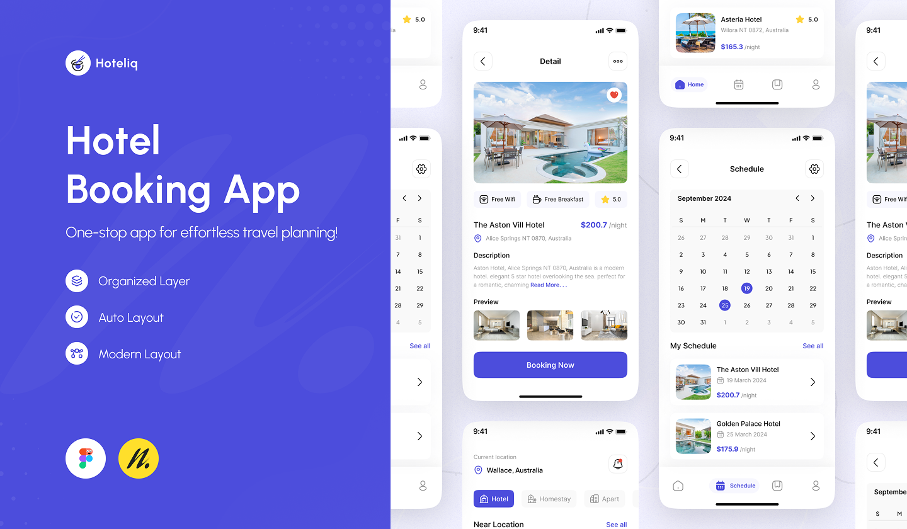
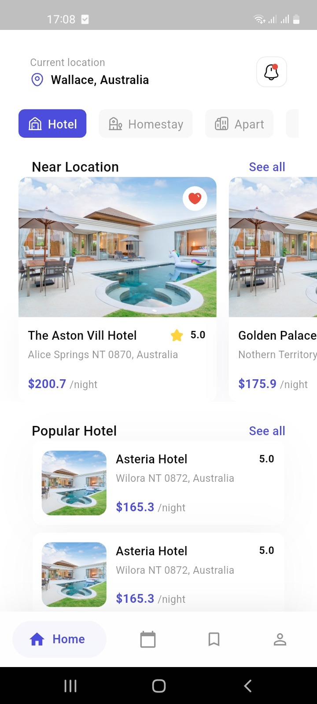
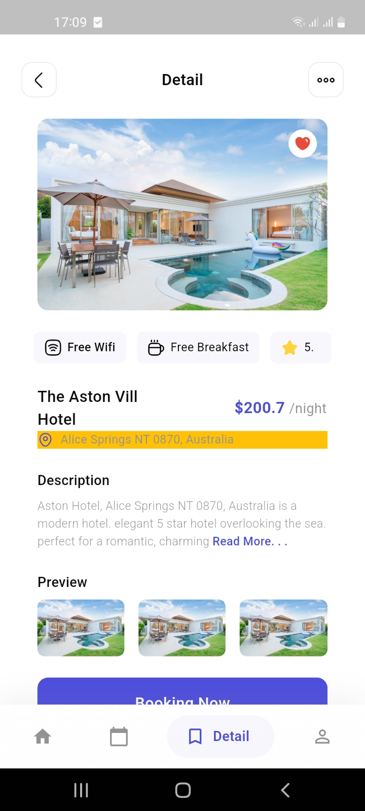
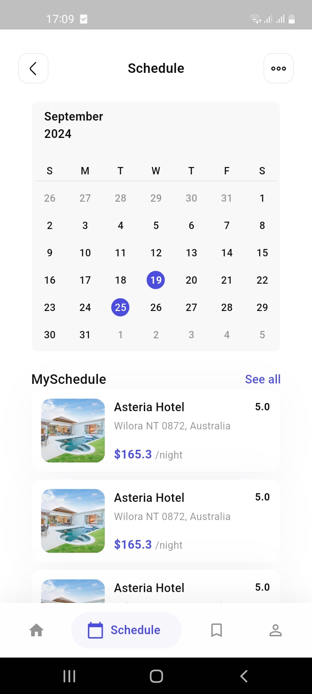

# 🏨 Hoteliq – Hotel Booking App (Flutter)

A sleek and modern **hotel booking app** built with **Flutter**, inspired by the beautiful [Hoteliq Figma design](https://www.figma.com/community/file/1169928945460966636).  
Plan your travels effortlessly with a clean interface, interactive calendar, and intuitive navigation.

---

## ✨ Preview

> 📲 Below is the original design reference that inspired this Flutter implementation:

---

## 📸 Screenshots from App

| Home Screen | Hotel Details | Schedule |
|-------------|----------------|----------|
|  |  |  |

---

